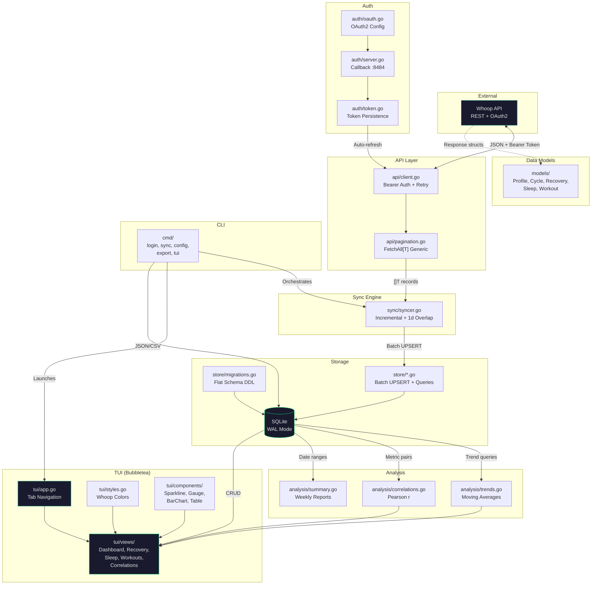
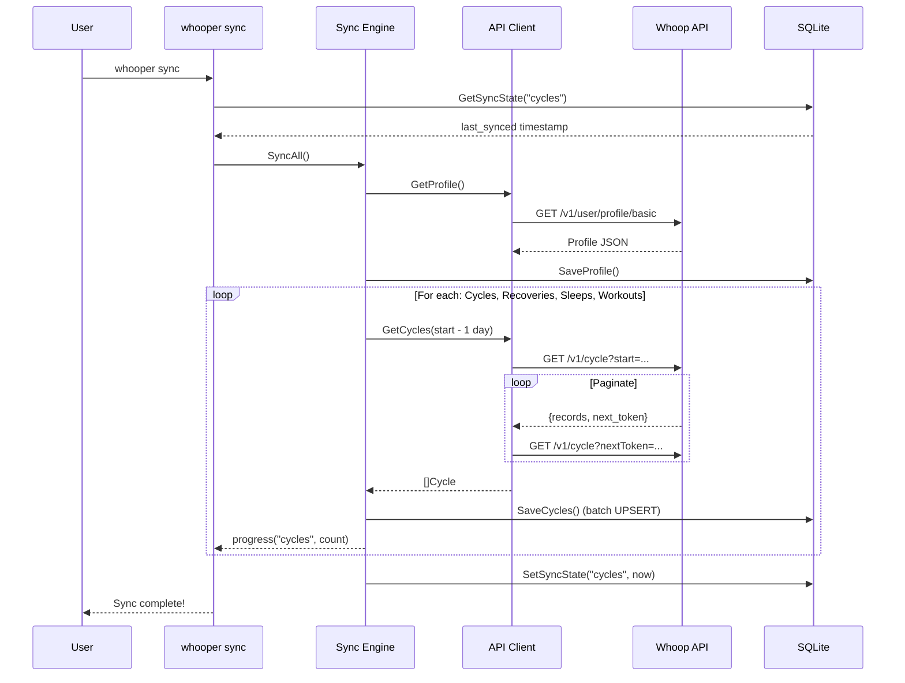
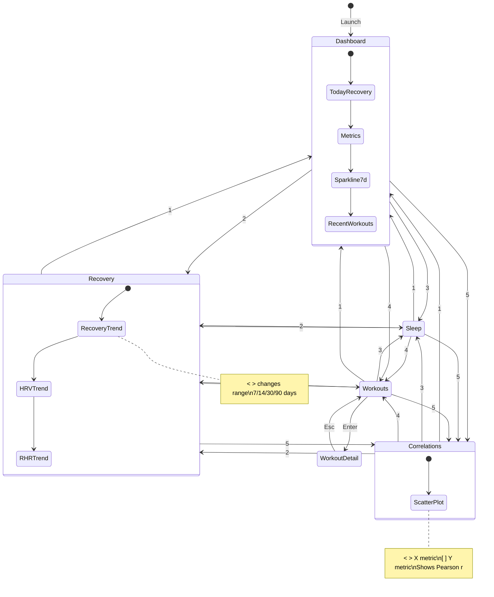
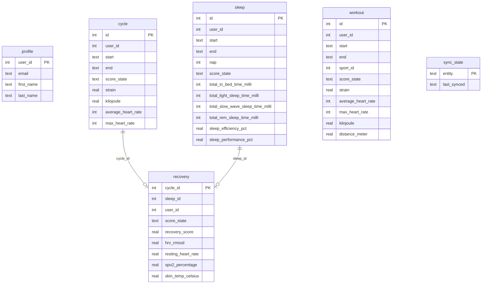

# Whooper

A CLI tool that syncs your [Whoop](https://www.whoop.com/) health data via the Whoop API and presents it in a rich terminal dashboard. Data is stored locally in SQLite for offline access and future extensibility (e.g. Grafana SQL data source).

## Features

- **OAuth2 Authentication** — Browser-based login flow with local callback server
- **Incremental Sync** — Fetches only new data with 1-day overlap for retroactive score updates
- **TUI Dashboard** — 5-tab terminal UI with recovery gauge, sleep stage bars, workout table, trend sparklines, and correlation scatter plots
- **Local SQLite Storage** — Pure-Go SQLite (no CGO), WAL mode, flat schema optimized for analytics
- **Export** — JSON and CSV export for all data types

## Quick Start

```bash
# Build
go build -o whooper .

# Configure API credentials (from developer.whoop.com)
whooper config set client-id <your-client-id>
whooper config set client-secret <your-client-secret>

# Authenticate
whooper login

# Sync data
whooper sync

# Launch dashboard
whooper
```

## Commands

| Command | Description |
|---------|-------------|
| `whooper` | Launch TUI dashboard (default) |
| `whooper login` | OAuth2 browser login flow |
| `whooper sync` | Fetch latest data from Whoop API |
| `whooper config` | Show current configuration |
| `whooper config set <key> <value>` | Set config (client-id, client-secret, redirect-url) |
| `whooper export -e <entity> -f <format>` | Export data (entities: cycles, recoveries, sleeps, workouts; formats: json, csv) |

## TUI Keybindings

| Key | Action |
|-----|--------|
| `1-5` | Switch tabs (Dashboard, Recovery, Sleep, Workouts, Correlations) |
| `Tab` | Next tab |
| `s` | Trigger sync |
| `< >` | Change time range (7/14/30/90 days) |
| `j/k` or `↑/↓` | Navigate lists |
| `Enter` | View detail / toggle |
| `[ ]` | Change Y metric (correlations view) |
| `q` | Quit |

## Architecture

```
whooper
├── main.go                          Entry point
├── cmd/                             CLI commands (Cobra)
│   ├── root.go                      Default → TUI
│   ├── login.go                     OAuth2 flow
│   ├── sync.go                      API → SQLite
│   ├── config.go                    Show/set credentials
│   ├── export.go                    JSON/CSV output
│   └── tui.go                       Wire views → app
│
└── internal/
    ├── config/                      ~/.whooper/ management
    │   └── config.go                YAML config, paths
    │
    ├── auth/                        Authentication
    │   ├── oauth.go                 OAuth2 config & scopes
    │   ├── server.go                Local :8484 callback server
    │   └── token.go                 Token save/load/auto-refresh
    │
    ├── models/                      Whoop API structs
    │   ├── profile.go               User profile
    │   ├── cycle.go                 Physiological cycles + strain
    │   ├── recovery.go              Recovery score, HRV, RHR, SpO2
    │   ├── sleep.go                 Sleep stages, need, efficiency
    │   ├── workout.go               Workouts, HR zones, sport map
    │   └── pagination.go            Generic paginated response
    │
    ├── api/                         HTTP client
    │   ├── client.go                Bearer auth, rate-limit retry
    │   ├── pagination.go            FetchAll[T] generic fetcher
    │   └── {profile,cycle,...}.go   Endpoint wrappers
    │
    ├── store/                       SQLite persistence
    │   ├── db.go                    Open, WAL mode
    │   ├── migrations.go            Schema DDL (flat tables)
    │   ├── queries.go               Trends, correlations, sync state
    │   └── {profile,cycle,...}.go   CRUD operations
    │
    ├── sync/
    │   └── syncer.go                Incremental sync orchestrator
    │
    ├── analysis/
    │   ├── trends.go                Moving averages, percent change
    │   ├── correlations.go          Pearson correlation
    │   └── summary.go               Weekly report generation
    │
    └── tui/                         Terminal UI (Bubbletea)
        ├── app.go                   Top-level model, tab navigation
        ├── keys.go                  Keybindings
        ├── styles.go                Whoop color palette
        ├── components/
        │   ├── sparkline.go         Unicode block sparklines
        │   ├── barchart.go          Horizontal bar charts
        │   ├── gauge.go             Recovery gauge
        │   └── table.go             Highlighted table
        └── views/
            ├── dashboard.go         Today's summary + sparklines
            ├── recovery.go          HRV/RHR/recovery trends
            ├── sleep.go             Stage bars, duration, efficiency
            ├── workouts.go          Sortable table + detail view
            └── correlations.go      Scatter plot + Pearson r
```

## Data Flow



### Sync Sequence



### TUI Navigation



### Database Schema



## Design Decisions

- **Flat SQLite schema** — Score sub-objects stored as columns, not separate tables. Optimized for analytics queries and direct use as a Grafana SQL data source.
- **Pure-Go SQLite** — `modernc.org/sqlite` requires no CGO, enabling easy cross-compilation.
- **Generics for pagination** — `FetchAll[T any]` avoids duplicating fetch logic across endpoints.
- **Auto-persisting token source** — Wrapper saves refreshed OAuth2 tokens to disk automatically.
- **Incremental sync with 1-day overlap** — Catches retroactively updated Whoop scores.
- **TUI as default command** — Running `whooper` with no args launches the dashboard.

## Configuration

All data is stored in `~/.whooper/`:

| File | Purpose |
|------|---------|
| `config.yaml` | Client ID, secret, redirect URL |
| `token.json` | OAuth2 access/refresh tokens |
| `whooper.db` | SQLite database |

## Dependencies

| Package | Purpose |
|---------|---------|
| `github.com/spf13/cobra` | CLI framework |
| `github.com/charmbracelet/bubbletea` | Terminal UI framework |
| `github.com/charmbracelet/lipgloss` | TUI styling |
| `github.com/charmbracelet/bubbles` | TUI components |
| `golang.org/x/oauth2` | OAuth2 flow |
| `modernc.org/sqlite` | Pure-Go SQLite driver |
| `github.com/go-resty/resty/v2` | HTTP client |
| `gopkg.in/yaml.v3` | Config parsing |
